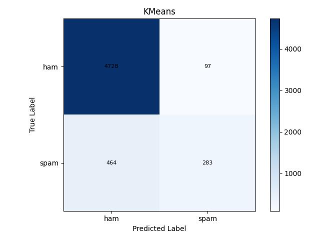
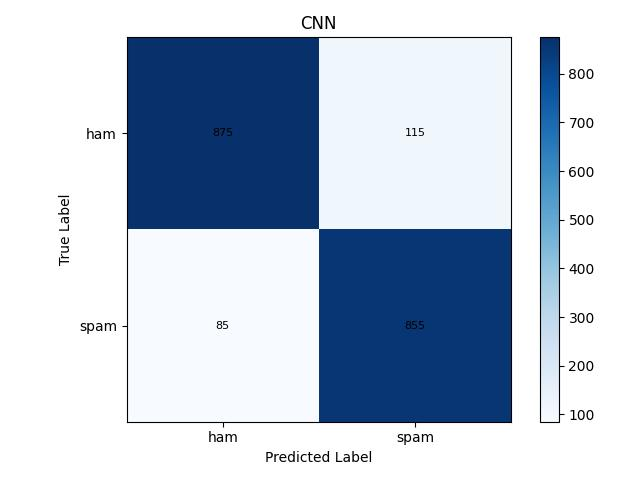
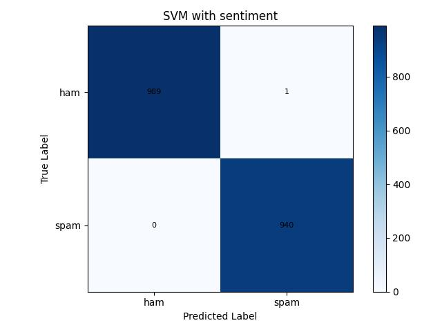

# SMSSpamDetection
SMS Spam Detection using Supervised, unsupervised and deep learning models

clone the repository:
    
    git clone https://github.com/ABHI2410/SMSSpamDetection.git

    cd SMSSpamDetection

Create virtual environment: 
    
    python3 -m venv venv 
    source venv/bin/activate

install requirements: 
    
    python3 -m pip install -r requirments.txt 

run the code: 
    
    python3 Model.py

|      Model      | Regular Accuracy | Accuracy with Sentiment Analysis  |
|:---------------:|:----------------:|:--------------------------:|
|      SVM        |      98.296      |           98.3856          |
|     KMeans      |      89.932      |           71.1953          |
|      CNN        |      98.744      |           98.9238          |

Confussion matrix

    

        
    

    

        
    

    

        
    

    

        
    

    

        
    

    

        
    

