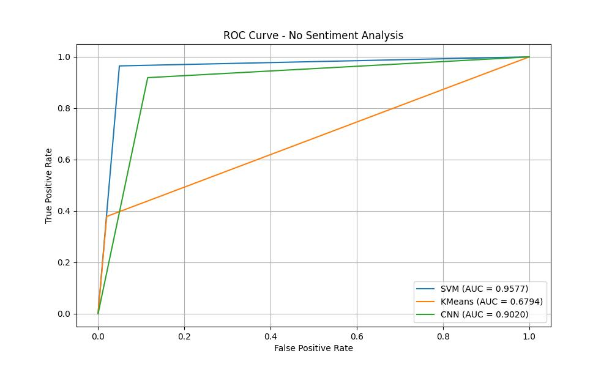
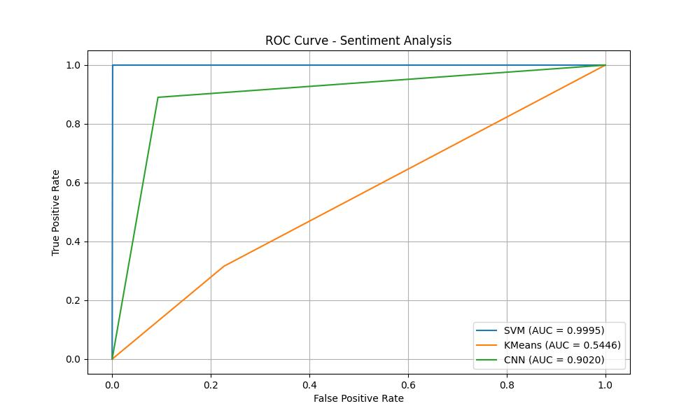

# SMSSpamDetection
SMS Spam Detection using Supervised, unsupervised and deep learning models

clone the repository:
    
    git clone https://github.com/ABHI2410/SMSSpamDetection.git

    cd SMSSpamDetection

Create virtual environment: 
    
    python3 -m venv venv 
    source venv/bin/activate

install requirements: 
    
    python3 -m pip install -r requirments.txt 

run the code: 
    
    python3 Model.py

|      Model      |      Regular Accuracy    | Accuracy with Sentiment Analysis  |
|:---------------:|:------------------------:|:---------------------------------:|
|      SVM        |      95.80310880829016   |         99.68911917098445         |
|     KMeans      |      89.93180186647524   |         71.19526202440775         |
|      CNN        |      89.63730335235596   |         91.19170904159546         |

ROC Curves for models 

